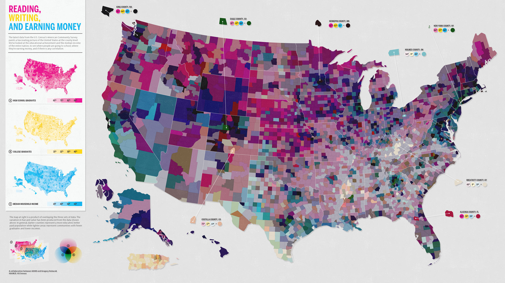
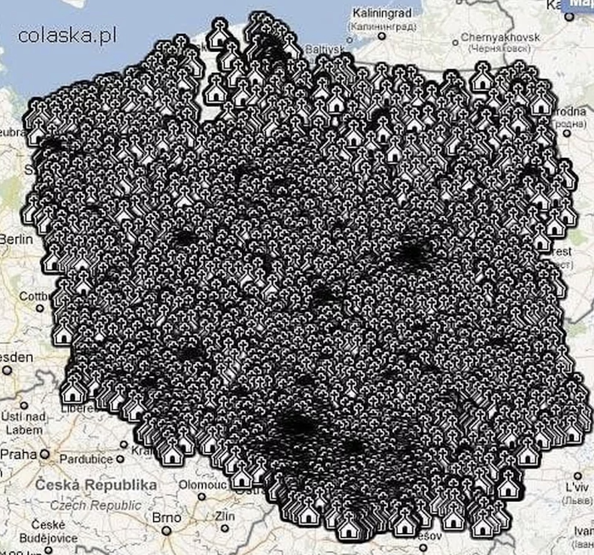

```{r setup, include=FALSE}
knitr::opts_chunk$set(echo = TRUE)

library(tidyverse)
library(pander)
library(sf)
library(terra)
library(units)
library(ggmap)
library(cartogram)
library(patchwork)
library(tmap)
library(viridis)

```


## Your assignment

The goals for this assignment are to:

- practice making maps with the various packages
- think about composition and the grammar of graphics
- critique various maps

_By the end of the assignment_ you should have several static maps displaying the datasets we've used in the last few weeks.

# Task 1: Show me your ugly maps!!
Find 2 examples of maps that you think are 'bad'. 




_Question 1_ Why are they bad? What might improve them? 
The first one has way too much information. It goes against the practice of proportional ink-- it is essentially all ink which loses any meaning. The color is also all blue/grey and the symbols are too large. 

_Question 2_ Rely on the Healy and Wilke texts to provide some structure to your answers.
The second map is also a case of less is more. I think they are attempting to join three different colored maps into one colored schemes and that is also just not how humans can think.

# Task 2: Load your libraries and build a dataframe
You can choose whichever datasets you'd like from the past several months as the subject for your mapping. You'll need to use at least one tabular join, one spatial join, and one extraction to create the dataframe. Load the packages, the data, and make sure everything is projected here. Give me a sense for what you are hoping to map.

```{r, echo=FALSE} 
r <- terra::rast("temp_rstr.tif") #using my template raster for research -- lol jk this is causing all sorts of issues
landval <- terra::rast("landvalrastmtwy.tif") #needed to get a different state and I had to crop the file from the boston lab to mt 
mammal.rich <- rast("/opt/data/session16/Mammals_total_richness.tif")
hmi <- rast("/opt/data/session08/hmi.tif")
mammal.rich <- catalyze(mammal.rich)
mammal.rich <- mammal.rich[[2]]

pas.desig <- st_read("/opt/data/session04/regionalPAs1.shp")
pas.proc <- st_read("/opt/data/session16/reg_pas.shp")

colnames(pas.proc)[c(1, 6, 8, 10, 12, 22, 25)] <- colnames(pas.desig) #find the columnames in the proc dataset and replace them with the almost matching names from the des.

gap.sts <- c("1", "2", "3") 
pas <- pas.proc %>% 
  select(., colnames(pas.desig)) %>% 
  bind_rows(pas.desig, pas.proc) %>%  #select the columns that match and then combine
  filter(., State_Nm == "MT" & GAP_Sts %in% gap.sts ) %>% st_make_valid() %>% st_buffer(., 10000)
#Buffering here to deal with some of the linear features along rivers

```

Bring in a map of Montana and match our projections
```{r}
mt <- tigris::states(cb=TRUE) %>% 
  filter(STUSPS == "MT") 

st_crs(mammal.rich)$proj4string
pa.vect <- as(pas, "SpatVector")
mt.vect <- as(mt, "SpatVector")

pa.vect <- project(pa.vect, mammal.rich)
mt.vect <- project(mt.vect, mammal.rich)

land.val.proj <- project(landval, mammal.rich)
hmi.proj <- project(hmi, mammal.rich)
mam.rich.crop <- crop(mammal.rich, mt.vect)
mt.val.crop <- crop(land.val.proj, mt.vect)
hmi.crop <- crop(hmi.proj, mt.vect)
```

Add some tidy census variables
```{r}
mt.census <- tidycensus:: get_acs(geography = "county", 
              variables = c(medianincome = "B19013_001", # I tried pretty hard to get this to be % poverty but kept getting errors :(
                            pop = "B01003_001"),
              state = c("MT"), 
              year = 2018,
              key = key,
              geometry = TRUE) %>% 
                st_transform(., crs(mammal.rich)) %>% 
  select(-moe) %>% 
  spread(variable, estimate)
```

Extract and put everything together into one df
```{r}
pa.summary <- st_join(st_as_sf(pa.vect), mt.census, join = st_overlaps)

pa.summary <- pa.summary %>% 
  group_by(Unit_Nm) %>% 
  summarize(., meaninc = mean(medianincome, na.rm=TRUE),
            meanpop = mean(pop, na.rm=TRUE))
#double check to see that I got the right number of rows
nrow(pa.summary) ==length(unique(pas$Unit_Nm))
## [1] TRUE
pa.zones <- terra::rasterize(pa.vect, mam.rich.crop, field = "Unit_Nm")
mammal.zones <- terra::zonal(mam.rich.crop, pa.zones, fun = "mean", na.rm=TRUE)
hmi.zones <- terra::zonal(hmi.crop, pa.zones, fun = "mean", na.rm=TRUE)
landval.zones <- terra::zonal(mt.val.crop, pa.zones, fun = "mean", na.rm=TRUE)
#Note that there is one few zone than we have in our PA dataset. This is because we have an overlapping jurisdicition; we'll ingnore that now but it's a common problement with using the PADUS

summary.df <- pa.summary %>% 
  left_join(., mammal.zones) %>% 
  left_join(., landval.zones) %>% 
  left_join(., hmi.zones)

colnames(summary.df)
```


# Task 3: Build a map with Tmap
Practice making a quick map with tmap. 

```{r}
tm_shape(mam.rich.crop) +
  tm_raster("Value", palette = viridis(n=50), n=50, legend.show=FALSE, legend.hist = TRUE, legend.hist.title = "Species Richness") +
tm_shape(mt) +
  tm_borders("white", lwd = .75) +
tm_shape(summary.df) +
  tm_polygons(col = "meaninc",  border.col = "white", title="Mean Income") + 
  tm_legend(outside = TRUE)

```


# Task 4: Build a choropleth with ggplot
Your map should have a basemap, should rely on more than one aesthetic (color, transparency, etc), and combine multiple layers.


# Task 5: Build 2 cartograms
Follow the examples to build cartograms that display your region of interest based on variables other than area.

_Question 3:_ Reflect on the different maps you've made, what do the different visualizations tell you about the data you plotted?

_Question 4:_ How might you improve the maps you've made?

_Question 5:_ Is a map the best way to evaluate the data you worked with? Why or Why not?


